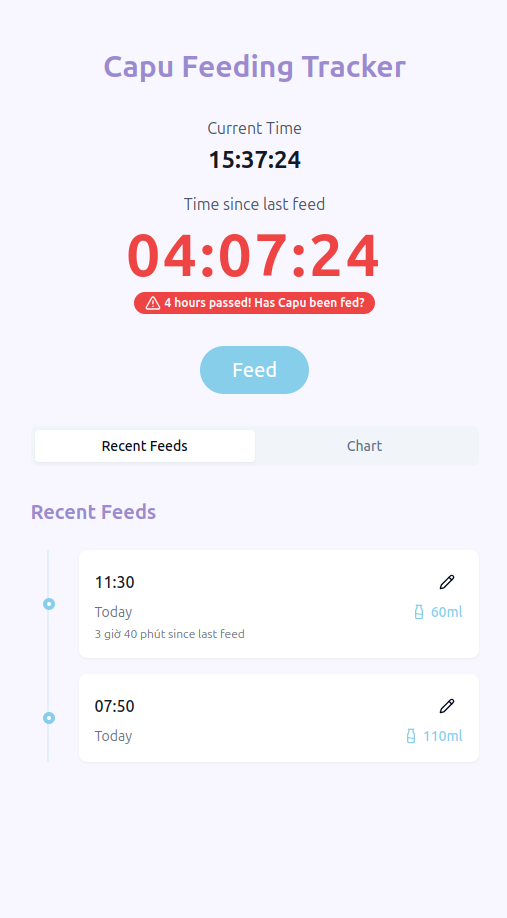
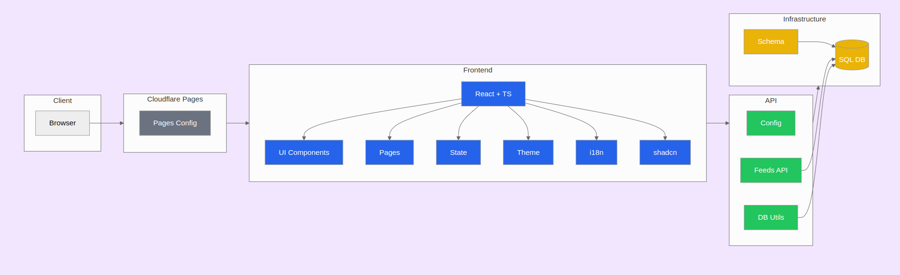

# Capufeed

This is a feeding tracker I made for my baby daughter (Capu).

## Tech Stack

- **Frontend**: React, TypeScript, Vite, TailwindCSS, shadcn/ui
- **State Management**: React Context 
- **Database**: SQLite
- **Internationalization**: Custom i18n solution
- **Containerization**: Docker

## Multi-language Support

Capufeed integrates a simple i18n solution to load language files dynamically, allowing users to switch language on the fly.

## Setup

1. Clone the repository and install dependencies:
   ```
   npm install
   ```
2. Start the development server:
   ```
   npm run dev
   ```
3. Visit the application at http://localhost:3000.

### Docker Setup

1. Pull and run using Docker Compose:
   ```
   docker compose up -d
   ```
2. Visit the application at http://localhost:2345.

## Screenshot



## Project Structure Diagram


